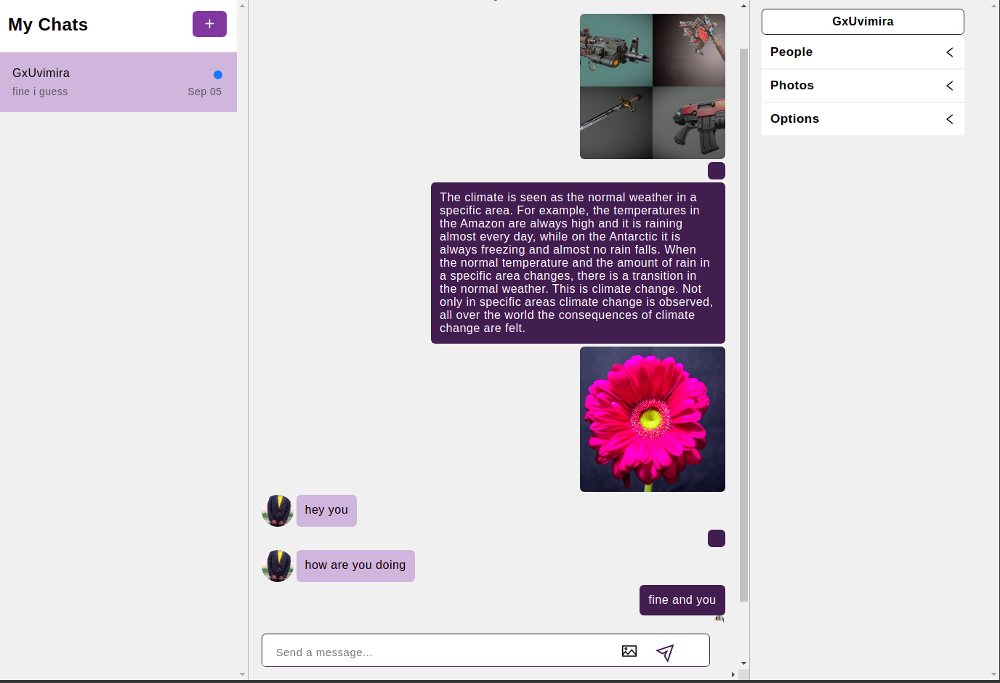

    

        

         
        
    
    
    

  

# BusinessInterface (Reactjs)

    

        

                
        
    
    
    

  

BleachChat is a chat application built with react-chat-engine.

# Installation

1. Simply clone the project from this project. After cloning the repository.

# Setting up the sample app

- Open the project.

- Run `cd bleashchatApp`.

- Hit `npm i`  to install the packages.

- Run `npm start`, use the test1 and test2 accounts both for usernames and password of both accounts to log in

Build and run the Sample App, Happy Coding.